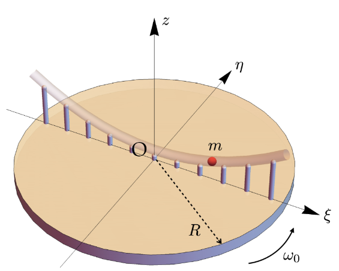

# Mechanics Assignment
Code for the solution to a assigment in a mechanics class.

## System
The system is a mass that can move freely in a tube that has a parabolic shape discribed with a function *f*. No friction between the mass and the yube is assumed. The tube sits on a platform that is spinning with a constant speed. See the image below:  

  
## Solution 
The numerical solution for position of the ball is showed below. The vectors at the bottom show the rotation of the platform.  

  
